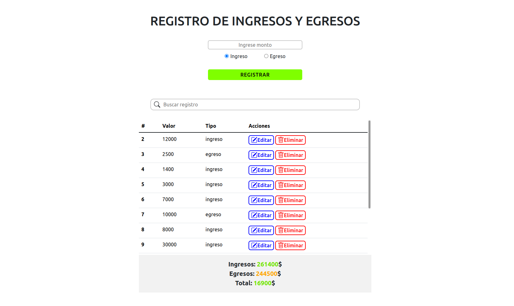
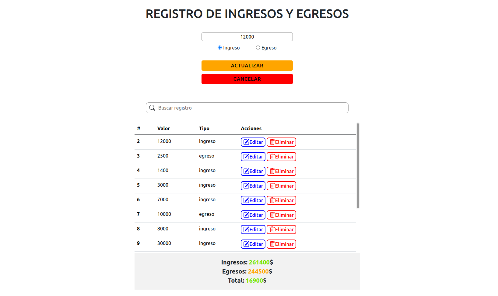

# Registro de Ingresos y Egresos

Este es un proyecto web simple que permite realizar un registro de ingresos y egresos. Los usuarios pueden ingresar un monto y especificar si se trata de un ingreso o un egreso. Los registros se muestran en una tabla y se pueden buscar y editar.

## Características

- Registro de ingresos y egresos.
- Búsqueda de registros por ID.
- Edición y eliminación de registros.
- Cálculo de totales de ingresos, egresos y saldo.

## Tecnologías utilizadas

- HTML
- CSS
- JavaScript (ES6)
- Bootstrap
- Node

## Cómo funciona

### Página principal (index.html)

La página principal muestra un formulario donde los usuarios pueden ingresar un monto y seleccionar si es un ingreso o un egreso. Al hacer clic en el botón "Registrar", se agrega una entrada a la tabla de registros.

### Búsqueda de registros

Se proporciona un campo de búsqueda que permite buscar registros por su ID. La búsqueda es sensible a mayúsculas y minúsculas y solo permite números. Los resultados de la búsqueda se muestran en la tabla de registros.

### Edición y eliminación de registros

Cada registro en la tabla tiene botones de "Editar" y "Eliminar". Al hacer clic en "Editar", se permite modificar el registro seleccionado. Al hacer clic en "Eliminar", se elimina el registro de forma permanente.

### Cálculo de totales

En la parte inferior de la página, se muestran los totales de ingresos, egresos y saldo. El saldo se calcula como ingresos menos egresos.

## Estilo (style.css)

El diseño de la página utiliza CSS para proporcionar una apariencia agradable y fácil de usar. Se han aplicado estilos a los formularios, botones y tablas para mejorar la experiencia del usuario.

## Scripts (main.js)

El archivo JavaScript maneja la lógica del proyecto. Aquí se realizan las siguientes acciones:

- Captura de datos del formulario.
- Envío de datos al servidor (simulado en el código) mediante solicitudes HTTP (GET, POST, PUT, DELETE).
- Actualización de la tabla de registros.
- Búsqueda y filtrado de registros.
- Cálculo de totales.
- Gestión de eventos de botones.

## Uso

Primero que todo debes tener instalado **Node**, en caso de no tenerlo instalado descarga la version **LTS** de la pagina oficial https://nodejs.org/es.

Una vez instalado, sigue estos pasos:

1. Clona este repositorio en tu máquina local.
   ```shell
   git clone https://github.com/jstorra/registroIngresos.git
   ```
2. Ejecuta el comando `npm i` para instalar las dependencias necesarias para el funcionamiento del proyecto.
3. Ejecuta el comando `npm run dev` para levantar el servidor y guardar los registros en el archivo `db.json`.
4. Abre el archivo `index.html` en tu navegador web.
5. Interactúa con la aplicación para registrar, buscar, editar y eliminar registros de ingresos y egresos.

## Contribuciones

Este proyecto es de código abierto y las contribuciones son bienvenidas. Si deseas contribuir, por favor abre un problema o envía una solicitud de extracción.

## Screenshots

- Registrar
  

- Actualizar
  

---

<p align="center">Developed by <a href="https://github.com/jstorra">@jstorra</a></p>
